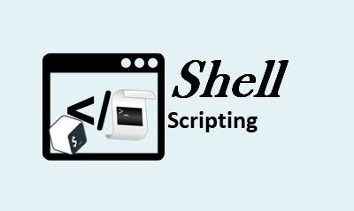
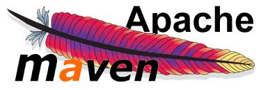
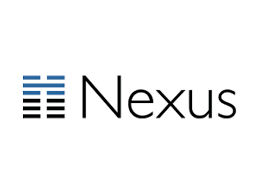

## Hi,I'm Mmadubugwu Chibuife E 👋

### I'm a AWS Solutions Architect/Devops engineer with a knack for Automation and a proven track record in maintaining and administering Cloud infrastructure and DevOps process.
- 🔭 I’m Open for contract roles, freelancing, part time/fulltime roles, (Remote role for any country)
- 🔭 Working Hours: Min 30hrs/wk  Mon - Friday 
- 🌱 Language: English - fluent
- 👯 Specialty: AWS Cloud Services and DevOps
- 🥅 Availability: I'm always available for your projects and jobs opporturnity
- ⚡ Hobbies: Travelling, Learning
-  👯 I’m looking to collaborate on Tech Events
-  📫 How to reach me: mmadubugwuchibuife@gmail.com

## Connect with me:

[][linkedin]
[][twitter]
[][instagram]

 
 

### Languages and Tools:

 

 

 

[linkedin]:https://www.linkedin.com/in/mmadubugwu-chibuife-emmanuel-4a4487150
[twitter]:https://twitter.com/JMCGLOBAL7?t=Ts9gMcRbvjGQAp19zmHLjg&s=09
[instagram]:https://instagram.com/jmcglobal_?igshid=MzNlNGNkZWQ4Mg==
[Gmail]:https://mmadubugwuchibuife@gmail.com
